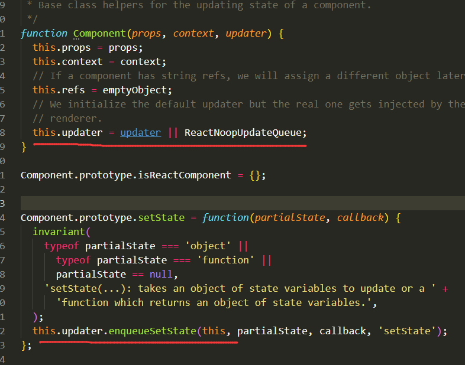
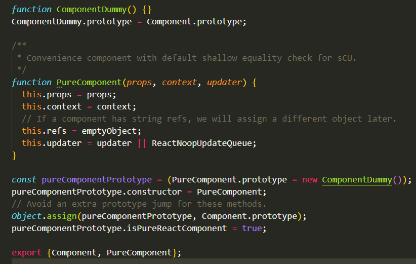

Component 与 PureComponent 都是 React对象暴露出来的基本组件API 。

1、Component：接收三个参数，props和context都清楚，主要是updater，它主要体现在下面的setState中，整个setState方法中，仅仅只是调用了传入的updater上的方法 enqueueSetState ，该方法主要是在 react-dom 中进行实现，因为react和React-Native 中都会使用到Component，但是两个不同的平台实现的方式都是不一样的，所有放在了 react-dom 中去进行后续操作。后续在 react-dom 进行讲解~
Component.prototype.forceUpdate = function(callback) {
   this.updater.enqueueForceUpdate(this, callback, 'forceUpdate');
};
此API 很少使用，它的目的是不管state是否有改变，强制react进行render刷新UI 。

2、PureComponent：

与Component差不多，入参一样，基本上都是继承Component的属性。
它们几乎完全相同，但是PureComponent通过prop和state的浅比较来实现shouldComponentUpdate，某些情况下可以用PureComponent提升性能
最主要的区别在 
pureComponentPrototype.isPureReactComponent = true;   识别该组件是 PureComponent .
