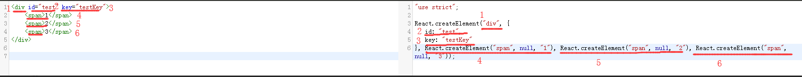
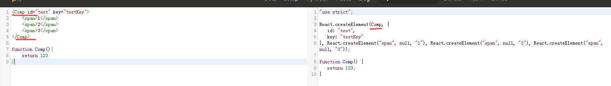
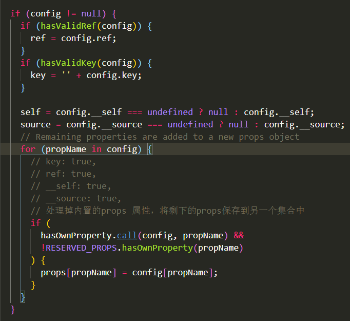
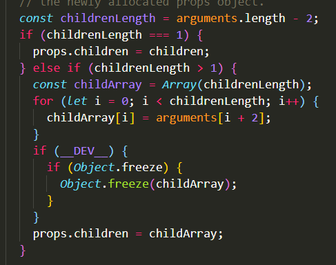

 1.为什么创建的组件要大写字母开头？ （为什么一个组件下render中的return中只能允许有一个子元素？）

 答：因为Babel在转换的时候，是根据首字母的大小写来判断这个是个标签还是组件变量，小写会被当成HTML标签，这样自定义的标签会编译过程中会报错。

  图中： 1 为div标签，在React.createElement 方法中，作为第一个字符串参数，个是这个标签中的第二属性（2、3），而后的参数是div下的直系children（4、5、6），React会把他们整合成 一个children的数组。
（这也就能解释为什么一个组件下render中的return中只能允许有一个子元素。）

2.createElement方法的源码分析
createElement接受三个参数：
  ● type : 节点类型 。 像图上的  “div”  ，  Comp
  ● config：节点上的属性值
  ● children： 子节点元素。 

props：在根节点的属性（props）上，主要是对 key 和 ref 进行存储，其他react自建（自己创建）属性__self , __source 不做深究。
React会将props遍历，过滤掉props中的自建属性，剩下的属性重新存储到props。

childeren：createElement用 argument - 2，将前面的两个参数（type，config）剔除掉，剩下的都存入props.children，如果子节点只有一个，则children不是数组，而是一个节点对象；如果是多个，则是以数组的方式返回。
最后将自建属性及props传给 ReactElement。
3.ReactElement源码分析：
    
最后返回element对象，其中包括自建属性，props等，其中最重要的是$$typeof ，这是一个元素的唯一React类型标志。

