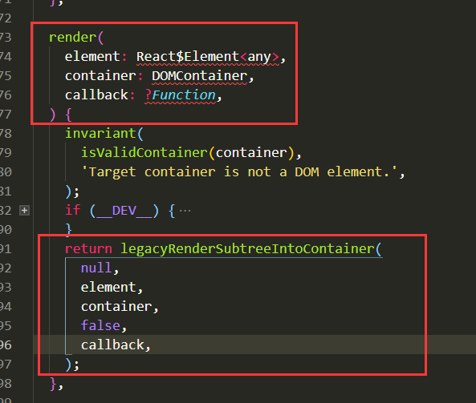
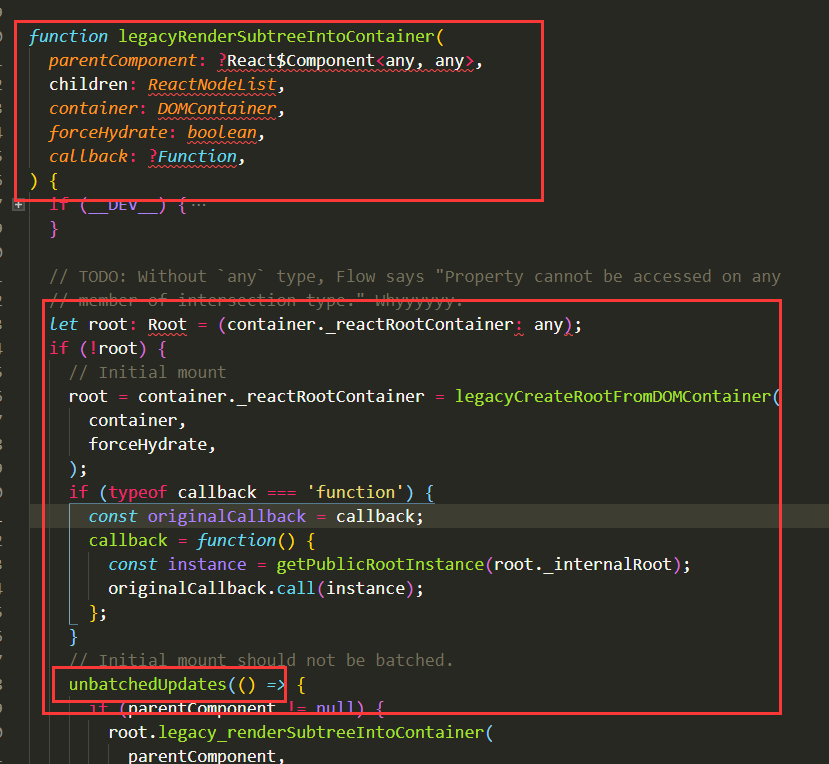
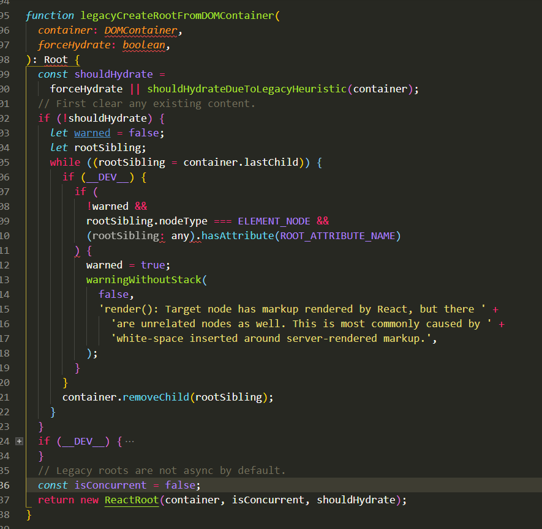
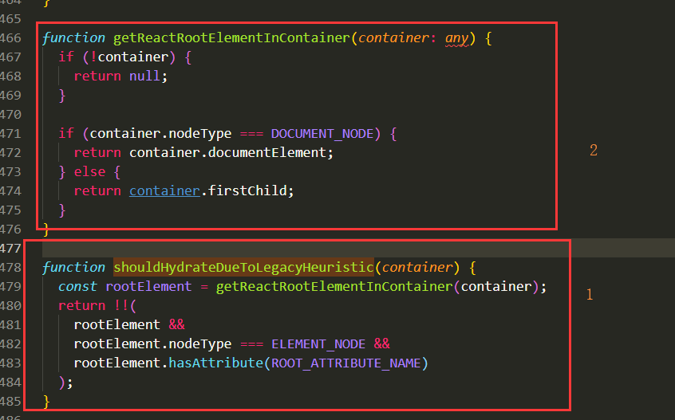
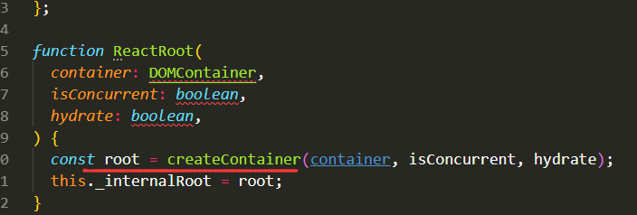
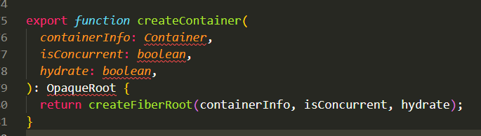
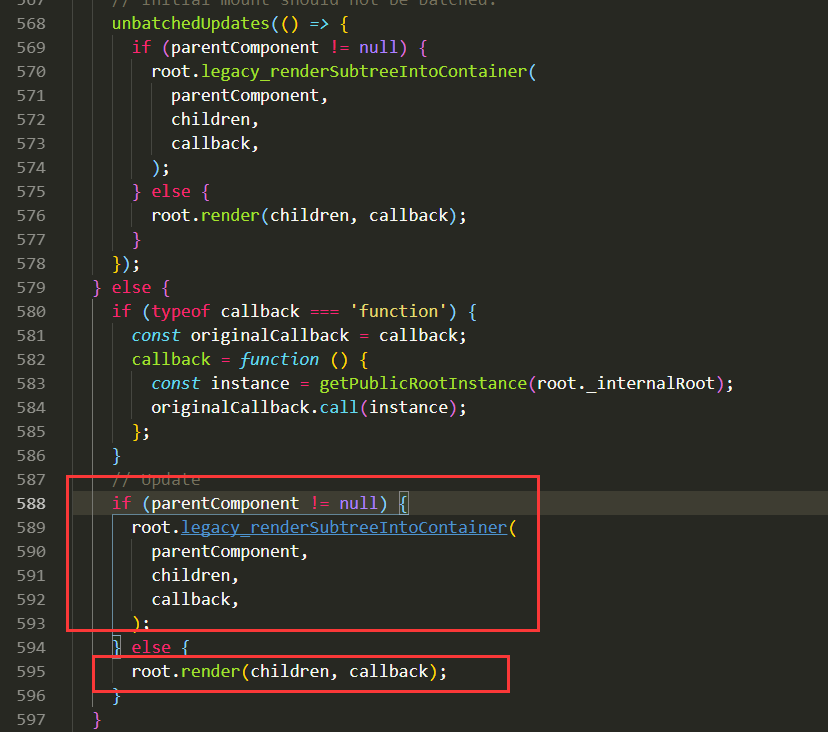

创建更新的3种方式：
一、ReactDOM.render：
  1、执行步骤：
     1）创建顶层的一个点，ReactRoot
     2）创建FiberRoot 和 RootFiber   
     3）创建更新
  
  2、ReactDOM.render（）源码分析：
    
    1）可以看到，render方法接收必须的有两个参数，第一个是React节点对象，第二个是要挂载到的容器，第三个是React节点对象渲染完成后的回调，可不传。
    2）后边返回一个函数 legacyRenderSubtreeIntoContainer ，其他三个参数能看明白，着重看第一个参数 null 和 第四个参数 false。
    
    

    从该方法的定义上可以看出，第一个参数null 表示还有没有上一级节点，第四个参数foreHydrate 表示是不是服务端渲染（就是 说有没有相同的HTML节点，进行复用，React.Hydrate（）主要是用于服务端渲染）。
    root = container._reactRootContainer，container是DOM节点，上面并没有_reactRootContainer属性，所以执行 
legacyCreateRootFromDOMContainer 函数，传入DOM节点和forceHydrate（是否是服务端渲染标识）。
    
    

    因为forceHydrate 为 false， 走 shouldHydrateDueToLegacyHeuristic 方法，传入DOM节点，在调用
getReactRootElementInContainer 方法传入DOM节点去判断这个DOM根节点是不是window.document的DOM，并判断它是否有子节点，如果有子节点，就默认为是Hydrate渲染，是否需要调和原来的子节点。
    然后判断是否存在，判断是否是element 节点，并且判断有没有 ROOT_ATTRIBUTE_NAME = 'data-reactroot' ，这个标识是表示在老版本中给根节点添加的一个属性，判断是否是服务端渲染。如果是服务端渲染就需要合并原来页面中的一个节点。（服务端渲染后期在嗨！）
    shouldHydrateDueToLegacyHeuristic后面返回一个false，表示不是服务端渲染，shouldHydrate 为 false，进入while循环，因为不是不服务端渲染，不需要合并原来的页面，循环中删除DOM根节点下的所有子节点。
     最后返回一个 new ReactRoot（），第一个参数为DOM节点，第二个为false （isConcurrent 表示DOM根节点不应该是async异步的），第三个表示是否是服务端渲染。
  3）接下来看 new ReactRoot 的过程。
    

ReactRoot 的目的就是创建一个顶层的节点 root。继续看 createContainer 方法是如何创建的。
    4）createContainer ，该API 位于 'react-reconciler/inline.dom'，react-reconciler 是react中最重要的一部分，就是关于任务的调度，更新都会在其中。
    

    从 createContainer  的源码看到，他最后返回的是 createFiberRoot 。下一节讲解。 
    最后经过一系列的 return 之后，调用 unbatchedUpdates 方法，该方法主要是批量更新的操作，
    
    

    不管是ReactDOM.render  还是 ReactDOM.Hydrate 传入的 parentComponent 一定是null ，所以走后面的 render。
    

