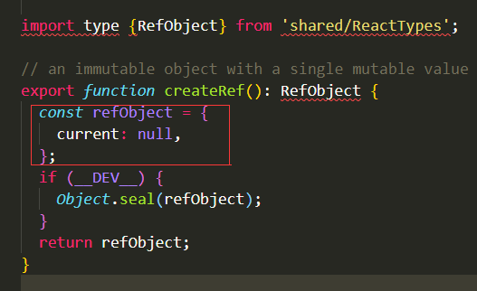

解决在react中获取DOM节点或者DOM节点的实例，可以通过ref属性进行获取到DOM节点。
react中通过ref获取DOM节点实例的方法有三种：
● 通过 string 的方式 : （17版本中会被删除该方法）
<button ref="button1">按钮</button>
this.refs.button1 就可以拿到DOM节点的实例
● 通过function的方式:
<button ref={ node => this.node = node }>按钮</button>
通过函数的方式获取DOM节点，方法中的参数node 就是DOM实例
● 通过React.createRef() :
<button ref={ this.nodeRef }>按钮</button>
在构造器中 this.nodeRef = React.createRef();  
React.createRef() 拿到的是一个对象，{ current：null } ，对象中的current 就是这个DOM实例，默认为null
使用的时候是，this.nodeRef.current 得到DOM实例。
但前提是必须在React 执行了第一此render 周期之后，因为在之前都是虚拟DOM点解，并不是以真实的DOM存在，所以在componentWillMount 中是拿不到ref 真实DOM实例的。必须在第一次render之后。

createRef源码分析：

从代码上看，createRef 非常简单，可以看出它默认的输出对象是 { current：null } 
具体它是如何挂载实例上去的，留到后边讲解ref更新的时候在说明。

